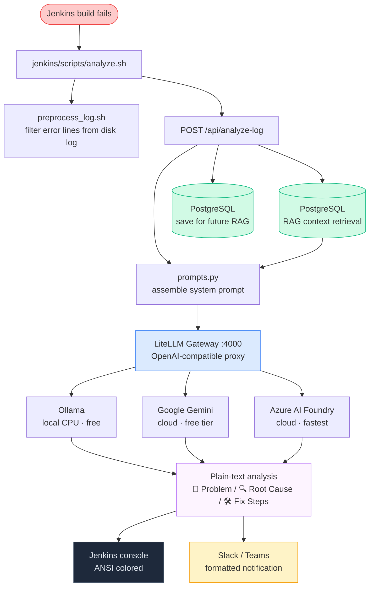
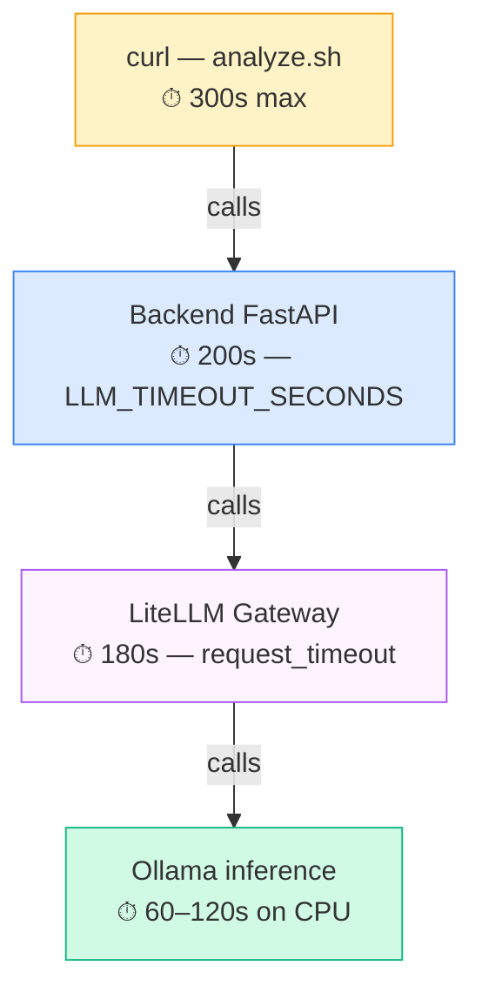

# AI Ops Log Analyzer

A self-hosted system that automatically analyzes failed CI/CD build logs using AI. When a Jenkins build fails, the pipeline preprocesses the log, sends it to a FastAPI backend, which retrieves similar past failures for context (RAG), calls an LLM for diagnosis, stores the result, and returns a structured plain-text analysis — printed to the Jenkins console with ANSI colors and optionally sent as a notification to Slack or Teams.

## How it works



---

## Services

| Service | Image | Port | Purpose |
|---|---|---|---|
| `db` | `pgvector/pgvector:pg16` | — | PostgreSQL with pgvector for RAG storage |
| `ollama` | `ollama/ollama:0.9.6` | — | Local LLM inference (optional, profile-gated) |
| `ollama-model` | `ollama/ollama:0.9.6` | — | One-shot container that pulls the Ollama model |
| `litellm` | `ghcr.io/berriai/litellm:main-v1.80.8-stable` | 4000 | LLM gateway — routes to Ollama, Gemini, or Azure |
| `backend` | `./backend` | **8000** | FastAPI service — the main entry point |

---

## Quick start

**Prerequisites:** Docker, Docker Compose v2, Python 3

### 1. Configure environment

```bash
cp .env.example .env
```

Generate a LiteLLM master key:
```bash
python3 -c "import secrets; print('sk-' + secrets.token_urlsafe(32))"
```

Edit `.env` and set at minimum:
```env
LITELLM_API_KEY=sk-<generated>
DB_PASSWORD=<strong-password>
```

### 2. Choose an LLM provider

**Google Gemini (recommended for getting started — free tier):**
```env
OLLAMA_PROVIDER_ENABLE=false
GOOGLE_GEMINI_PROVIDER_ENABLE=true
GOOGLE_GEMINI_API_KEY=<key from aistudio.google.com/app/apikey>
GOOGLE_GEMINI_MODEL=gemini-3.5-flash-lite
```
Get a free API key at [aistudio.google.com/app/apikey](https://aistudio.google.com/app/apikey) — use a project without a billing account attached.

**Ollama local (no credentials, but slow on CPU):**
```env
OLLAMA_PROVIDER_ENABLE=true
GOOGLE_GEMINI_PROVIDER_ENABLE=false
```
Start with the `ollama` profile (see step 3).

**Azure AI Foundry (fastest, requires Entra Service Principal):**
```env
OLLAMA_PROVIDER_ENABLE=false
AZURE_FOUNDRY_PROVIDER_ENABLE=true
AZURE_CLIENT_ID=...
AZURE_CLIENT_SECRET=...
AZURE_TENANT_ID=...
AZURE_API_BASE=https://<resource>.openai.azure.com
AZURE_API_VERSION=2024-10-21
AZURE_MODEL=gpt-4o-mini
```

### 3. Start the stack

**Cloud provider only (Gemini or Azure):**
```bash
docker compose up -d --build
```

**With Ollama local:**
```bash
docker compose --profile ollama up -d --build
```

Ollama pulls the configured model on first start — this may take a few minutes.

### 4. Run database migrations

```bash
docker compose run --rm backend alembic upgrade head
```

### 5. Verify

```bash
curl -f http://localhost:8000/health
# → {"status":"ok"}
```

### 6. Test a manual analysis

```bash
curl -sS -X POST http://localhost:8000/api/analyze-log \
  -H "Content-Type: application/json" \
  -d '{
    "build_number": "demo-1",
    "cleaned_log": "ERROR: Build failed\nModuleNotFoundError: No module named demo_dependency\nBuild step failed with exit code 1"
  }'
```

### 7. Open Swagger UI

`http://localhost:8000/docs` — includes three example payloads for quick testing.

---

## AI provider modes

Priority when multiple providers are enabled: **Azure AI Foundry > Google Gemini > Ollama**

| Mode | `OLLAMA` | `AZURE` | `GEMINI` | Notes |
|---|---|---|---|---|
| Gemini only (recommended) | `false` | `false` | `true` | Free tier, ~3-10s, API key only |
| Ollama only | `true` | `false` | `false` | Free, ~60-120s on CPU, no internet |
| Azure only | `false` | `true` | `false` | Fastest, requires Entra SP |
| Gemini + Ollama fallback | `true` | `false` | `true` | Gemini primary, Ollama on failure |
| Azure + Gemini + Ollama | `true` | `true` | `true` | Full fallback chain |

---

## Notifications

Configure in `.env` (or Jenkins Managed File / Credentials — see `jenkins/README.md`):

```env
# Slack
SLACK_NOTIFY_ENABLE=true
SLACK_WEBHOOK_URL=https://hooks.slack.com/services/...

# Microsoft Teams (Power Automate)
TEAMS_NOTIFY_ENABLE=true
TEAMS_WEBHOOK_URL=https://prod-xx.logic.azure.com:443/workflows/...
```

Both are optional and independent.

---

## Environment variables reference

| Variable | Required | Default | Description |
|---|---|---|---|
| `DB_PASSWORD` | Yes | — | PostgreSQL password |
| `DB_USER` | Yes | — | PostgreSQL user |
| `DB_NAME` | Yes | — | PostgreSQL database name |
| `LITELLM_API_KEY` | Yes | — | Shared secret between backend and LiteLLM |
| `OLLAMA_PROVIDER_ENABLE` | No | `true` | Enable Ollama |
| `AZURE_FOUNDRY_PROVIDER_ENABLE` | No | `false` | Enable Azure AI Foundry |
| `GOOGLE_GEMINI_PROVIDER_ENABLE` | No | `false` | Enable Google Gemini |
| `GOOGLE_GEMINI_API_KEY` | When Gemini enabled | — | Google AI Studio API key |
| `GOOGLE_GEMINI_MODEL` | No | `gemini-3.5-flash-lite` | Gemini model name |
| `OLLAMA_MODEL` | No | `qwen2.5-coder:7b` | Ollama model to pull and use |
| `AZURE_CLIENT_ID` | When Azure enabled | — | Entra Service Principal app ID |
| `AZURE_CLIENT_SECRET` | When Azure enabled | — | Entra Service Principal secret |
| `AZURE_TENANT_ID` | When Azure enabled | — | Entra tenant ID |
| `AZURE_API_BASE` | When Azure enabled | — | Azure OpenAI endpoint URL |
| `AZURE_API_VERSION` | No | `2024-10-21` | Azure OpenAI API version |
| `AZURE_MODEL` | No | `gpt-4o-mini` | Azure deployment name |
| `SIMILARITY_SEARCH_MODE` | No | `keyword` | RAG mode: `keyword` or `vector` |
| `RAG_TOP_N` | No | `3` | Max past analyses used as context |
| `RAG_CONTEXT_MAX_CHARS` | No | `4000` | Max RAG context characters |
| `LLM_TIMEOUT_SECONDS` | No | `200` | Backend LLM call timeout |
| `BACKEND_URL` | No | `http://backend:8000` | URL Jenkins uses to reach the backend |
| `ANSI_CONSOLE` | No | `true` | Enable ANSI colors in Jenkins log (requires AnsiColor plugin) |
| `TEAMS_NOTIFY_ENABLE` | No | `false` | Enable Teams notifications |
| `TEAMS_WEBHOOK_URL` | No | — | Teams Power Automate webhook URL |
| `SLACK_NOTIFY_ENABLE` | No | `false` | Enable Slack notifications |
| `SLACK_WEBHOOK_URL` | No | — | Slack incoming webhook URL |

---

## Useful commands

```bash
# Live backend logs
docker compose logs -f backend

# All logs
docker compose logs -f

# Restart LiteLLM after config change
docker compose restart litellm

# Rebuild backend after code change
docker compose up -d --build backend

# Run migrations
docker compose run --rm backend alembic upgrade head

# Stop stack
docker compose down

# Stop and wipe all data (DB + Ollama models)
docker compose down -v
```

---

## Timeout chain



---

## Project structure

```
.
├── backend/          FastAPI service (Python)
├── demo-app/         Spring Boot demo with intentional bugs (Java)
├── jenkins/
│   ├── Jenkinsfile   Declarative pipeline
│   └── scripts/
│       ├── analyze.sh          Request AI analysis, export AI_* vars
│       ├── notify.py           Send Slack/Teams notifications
│       ├── preprocess_log.sh   Filter Jenkins log to error lines
│       └── preprocess.py       Pure log filtering logic
├── litellm/
│   ├── generate_config.py      Build LiteLLM config from provider flags
│   └── config.*.yaml           Static configs (legacy, kept for reference)
├── docker-compose.yml
├── .env.example
└── Makefile
```

> Never commit `.env`, API keys, or webhook URLs to version control.
