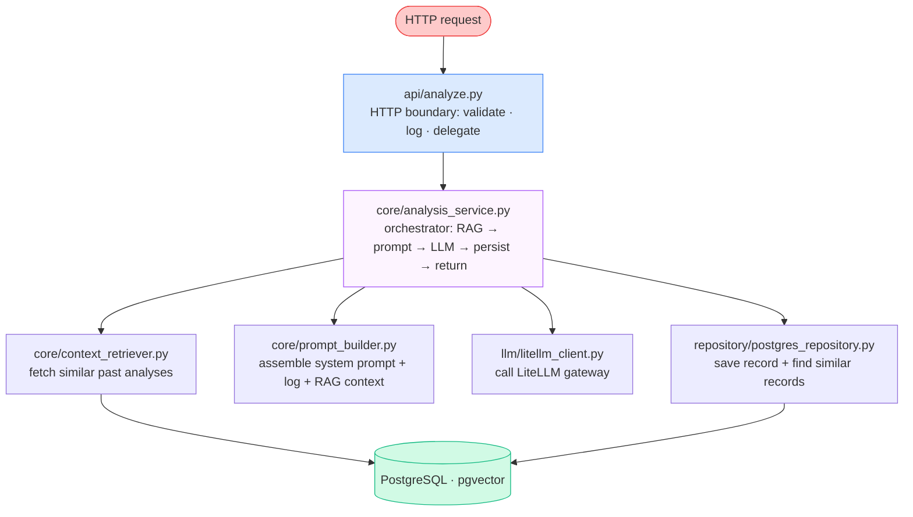

# Backend — AI Ops Log Analyzer

FastAPI service that receives a preprocessed build log, enriches it with similar past analyses (RAG), calls an LLM via LiteLLM, stores the result in PostgreSQL, and returns a plain-text analysis structured in three sections.

## Architecture



### Layers

| Layer | Path | Responsibility |
|---|---|---|
| API | `app/api/` | HTTP validation, request_id, structured logs, no business logic |
| Core | `app/core/` | Business logic: orchestration, RAG retrieval, prompt building |
| LLM | `app/llm/` | LiteLLM gateway client, timeout, error mapping |
| Repository | `app/repository/` | Database reads and writes, query timeout |
| DB | `app/db/` | SQLAlchemy session, typed config loaded once at startup |
| Models | `app/models/` | Pydantic DTOs (HTTP contract) + SQLAlchemy ORM (persistence) |

---

## Request flow

1. `POST /api/analyze-log` receives `{ build_number, cleaned_log }`
2. Pydantic validates the body — rejects blank or oversized logs with HTTP 422
3. A UUID `request_id` is generated and bound to the log context
4. `REQUEST_RECEIVED` logged (build_number, log_length, client header — never log content)
5. `AnalysisService.analyze()` is called:
   - **RAG retrieval** — extracts error keywords from the log, queries PostgreSQL for the top-N most similar past analyses; degrades silently to empty context on any failure
   - **Prompt building** — assembles `[system_message, user_message]` with build number, cleaned log, and optional RAG context block
   - **LLM call** — `LLM_CALL_STARTED` logged, `litellm_client.complete()` called with configured timeout; `LLM_CALL_COMPLETED` logged with provider, model, duration_ms
   - **Persistence** — saves `AnalysisRecord` to PostgreSQL; failure is logged and swallowed, never blocks the response
6. `RESPONSE_SENT` logged with status_code, provider, model, duration_ms
7. Response: `text/plain` body + `X-AI-Provider`, `X-AI-Model`, `X-AI-Request-ID` headers

---

## Analysis output format

The LLM is instructed to respond in **plain text** with exactly three labeled sections. Plain text is used deliberately so the output renders correctly in Jenkins console, Slack Block Kit, and Teams without any stripping or conversion.

```
🚨 Problem
A concise 1-3 sentence summary of the main error.

🔍 Root Cause
The underlying cause. Numbered lines for multiple causes.
1. `calculateDiscount` threw `NullPointerException` because...
2. Boundary condition uses `>` instead of `>=` at the `$1000` threshold.

🛠️ Fix Steps
Specific, actionable steps.
1. Add `Objects.requireNonNull(amount)` at the top of `calculateDiscount`.
2. Change `>` to `>=` in `OrderService.java` line 97.
3. Run `mvn test` to verify all 14 tests pass.
```

Technical terms (class names, method names, commands, error types) are wrapped in backticks so Slack renders them as `monospace` highlights. The Jenkins notification script (`notify.py`) strips backticks for console output and converts them to mrkdwn for Slack.

Section label constants are defined in `app/core/prompts.py` and shared with `jenkins/scripts/notify.py` (which parses the output by these labels).

---

## RAG (Retrieval-Augmented Generation)

Past analyses stored in PostgreSQL are used as context for new requests, helping the LLM recognize patterns from previous failures.

Two search modes are available, controlled by `SIMILARITY_SEARCH_MODE`:

| Mode | How it works | When to use |
|---|---|---|
| `keyword` (default) | Extracts error tokens from the log, queries by `ILIKE` match | Works out of the box, no embedding model needed |
| `vector` | Embeds the log as a float vector, queries by cosine distance via pgvector | Better semantic matching; requires an embedder injected at startup |

In both modes:
- At most `RAG_TOP_N` records are returned (default: 3)
- The current build is excluded from results to avoid self-reference
- Assembled context is capped at `RAG_CONTEXT_MAX_CHARS` characters (default: 4000)
- Any retrieval failure degrades silently to empty context

---

## Structured log events

| Event | Level | When |
|---|---|---|
| `APP_STARTUP` | INFO | Service starts; logs provider, version |
| `REQUEST_RECEIVED` | INFO | Inbound request; logs build_number, log_length, client — never log content |
| `LLM_CALL_STARTED` | INFO | Just before calling LiteLLM |
| `LLM_CALL_COMPLETED` | INFO | After LLM responds; logs provider, model, duration_ms |
| `RESPONSE_SENT` | INFO | After response written; logs status_code, duration_ms |
| `RAG_RETRIEVAL_FAILED` | WARN | RAG query failed; analysis continues without context |
| `ANALYSIS_RECORD_SAVE_FAILED` | ERROR | DB write failed; analysis result still returned |
| `GATEWAY_ERROR` | ERROR | LiteLLM call failed; HTTP 502 returned |

---

## API reference

### `POST /api/analyze-log`

**Request body:**
```json
{
  "build_number": "42",
  "cleaned_log": "ERROR: Build failed\nModuleNotFoundError: No module named foo"
}
```

**Constraints:**
- `build_number`: required, non-empty string
- `cleaned_log`: required, non-empty, non-blank, max 10,000 characters

**Success — HTTP 200:**
- Body: plain-text analysis with three labeled sections (see format above)
- Headers: `X-AI-Provider`, `X-AI-Model`, `X-AI-Request-ID`

**Error responses:**
- `422` — validation failure (missing field, blank log, oversized log)
- `502` — LLM gateway unavailable

### `GET /health`

Returns `{"status": "ok"}` with HTTP 200. Used by Docker Compose healthcheck.

### Swagger UI

Open `http://localhost:8000/docs` to test interactively. Three example payloads are available in the dropdown:
- Python ModuleNotFoundError
- Docker build failure
- Unit test failure

Also available: `http://localhost:8000/redoc`, `http://localhost:8000/openapi.json`

---

## LLM providers

The backend talks to LiteLLM, which routes to the configured provider. Priority when multiple are enabled: **Azure AI Foundry > Google Gemini > Ollama**.

| Provider | Speed | Cost | Setup |
|---|---|---|---|
| Ollama (local) | ~60-120s on CPU | Free | No credentials needed |
| Google Gemini | ~3-10s | Free tier available | `GOOGLE_GEMINI_API_KEY` |
| Azure AI Foundry | ~3-10s | Pay-as-you-go | Entra Service Principal |

Enable flags in `.env`:
```env
OLLAMA_PROVIDER_ENABLE=false
GOOGLE_GEMINI_PROVIDER_ENABLE=true
AZURE_FOUNDRY_PROVIDER_ENABLE=false
```

**Google Gemini free tier:** create an API key at [aistudio.google.com/app/apikey](https://aistudio.google.com/app/apikey) from a project without billing attached. Free tier supports `gemini-3.5-flash-lite` with 1,000 requests/day.

---

## Running locally (outside Docker)

```bash
cd backend

python3 -m venv .venv
source .venv/bin/activate
pip install -r requirements.txt

# Required env vars
export LITELLM_API_KEY=sk-...
export DB_HOST=localhost
export DB_PORT=5432
export DB_NAME=ai_ops
export DB_USER=ai_ops_user
export DB_PASSWORD=...
export LITELLM_BASE_URL=http://localhost:4000

# Run migrations
alembic upgrade head

# Start server
uvicorn app.main:app --host 0.0.0.0 --port 8000 --reload
```

---

## Database migrations

Migrations are managed with Alembic. Files live in `migrations/versions/`.

| Migration | What it does |
|---|---|
| `0001_create_analysis_record` | Creates the `analysis_record` table |
| `0002_enable_pgvector_add_embedding` | Enables pgvector extension, adds `embedding` column |

```bash
# Apply all pending migrations
docker compose run --rm backend alembic upgrade head

# Check current state
docker compose run --rm backend alembic current

# Create a new migration
docker compose run --rm backend alembic revision --autogenerate -m "description"
```

---

## Configuration reference

All configuration is read at startup via `app/db/config.py`. The service fails fast if any required variable is missing.

| Variable | Required | Default | Description |
|---|---|---|---|
| `DB_HOST` / `DATABASE_URL` | Yes | — | PostgreSQL connection host |
| `DB_NAME`, `DB_USER`, `DB_PASSWORD` | Yes | — | PostgreSQL credentials |
| `LITELLM_API_KEY` | Yes | — | Shared secret with LiteLLM gateway |
| `LITELLM_BASE_URL` | No | `http://litellm:4000` | LiteLLM gateway URL |
| `OLLAMA_PROVIDER_ENABLE` | No | `true` | Enable Ollama |
| `AZURE_FOUNDRY_PROVIDER_ENABLE` | No | `false` | Enable Azure AI Foundry |
| `GOOGLE_GEMINI_PROVIDER_ENABLE` | No | `false` | Enable Google Gemini |
| `GOOGLE_GEMINI_API_KEY` | When Gemini enabled | — | Google AI Studio API key |
| `GOOGLE_GEMINI_MODEL` | No | `gemini-3.5-flash-lite` | Gemini model name |
| `SIMILARITY_SEARCH_MODE` | No | `keyword` | `keyword` or `vector` |
| `RAG_TOP_N` | No | `3` | Max similar records for RAG context |
| `RAG_CONTEXT_MAX_CHARS` | No | `4000` | Max RAG context length in characters |
| `LLM_TIMEOUT_SECONDS` | No | `200` | LLM call timeout |
| `DB_QUERY_TIMEOUT_SECONDS` | No | `5` | Database statement timeout |
| `APP_ENV` | No | `production` | `development`, `staging`, `production`, or `test` |
