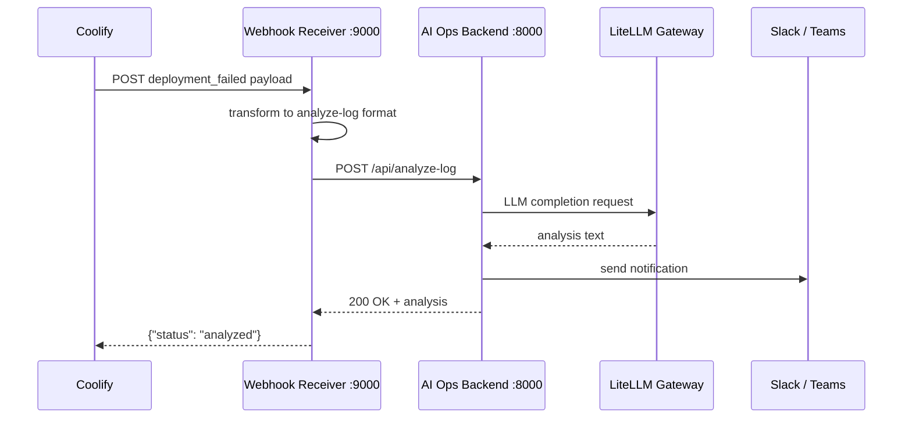

# Coolify Integration — AI Ops Log Analyzer

Connects Coolify deployment failures to the AI Ops backend. Coolify sends
a JSON webhook to a lightweight receiver script included here. The receiver
transforms the Coolify payload format into `POST /api/analyze-log` and lets
the backend handle LLM analysis and Slack/Teams notifications.

## Why a receiver is needed

Jenkins and ArgoCD can call the backend directly because their notification
systems let you fully control the request body. Coolify uses a fixed webhook
payload schema — a thin adapter is needed to translate it.



## Supported Coolify events

| Event | Description |
|---|---|
| `deployment_failed` | Application deployment failed |
| `status_changed` | Application stopped unexpectedly |
| `container_stopped` | Container stopped unexpectedly |
| `task_failed` | Scheduled task failed |
| `backup_failed` | Database backup failed |
| `server_unreachable` | Coolify cannot reach a server |

Success events (`deployment_success`, `backup_success`, etc.) are acknowledged
but not forwarded — the backend only analyzes failures.

## Quick start

### Option A — Docker Compose (alongside the AI Ops stack)

From the repository root:

```bash
docker compose \
  -f docker-compose.yml \
  -f coolify/docker-compose.coolify-receiver.yml \
  up -d --build
```

The receiver starts on port `9000` and forwards failures to the backend
container over the internal Docker network.

### Option B — Standalone Python (no Docker)

```bash
export AI_OPS_BACKEND_URL=http://localhost:8000
export RECEIVER_PORT=9000

python3 coolify/webhook_receiver.py
```

## Configure Coolify

1. Open your Coolify dashboard
2. Go to **Settings → Notifications → Webhook**
3. Set **URL** to:
   ```
   http://<your-host>:9000
   ```
4. Optionally set a **Secret** — copy the same value into the receiver's
   `RECEIVER_SECRET` environment variable
5. Click **Send Test Notification** to verify the connection

## Environment variables

| Variable | Default | Description |
|---|---|---|
| `AI_OPS_BACKEND_URL` | `http://localhost:8000` | AI Ops backend URL |
| `RECEIVER_PORT` | `9000` | Port the receiver listens on |
| `RECEIVER_SECRET` | _(empty)_ | Shared secret for HMAC-SHA256 signature verification |

## Request forwarded to the backend

The receiver assembles a `cleaned_log` from Coolify metadata and sends:

```json
{
  "build_number": "my-app",
  "job_name":     "coolify/my-app",
  "build_url":    "https://coolify.example.com/deploy/abc123",
  "cleaned_log":  "Coolify Event: deployment_failed\nMessage: Deployment failed\nApplication: my-app\nProject: production\nEnvironment: Production\n..."
}
```

## Comparison with other integrations

| Aspect | Jenkins | ArgoCD | Coolify |
|---|---|---|---|
| Trigger | Build failure | App health/sync state | Deployment / container events |
| Log source | Jenkins build log file | K8s metadata fields | Coolify webhook payload |
| Adapter needed | No (direct curl) | No (Notifications template) | Yes (`webhook_receiver.py`) |
| Infrastructure | Any agent | Kubernetes cluster | Any server / VPS |
| Self-hosted | Yes | Yes (K8s) | Yes (Docker) |
| Free | Yes | Yes | Yes |

All three integrations share the same `POST /api/analyze-log` contract and
the same Slack/Teams notification pipeline in the backend.

## Coolify overview

Coolify is a free, open source (Apache 2.0) self-hosted platform-as-a-service.
It deploys applications, databases, and services from Git repositories or
Docker images to any server via SSH — a self-hosted alternative to Heroku,
Railway, or Render.

**Key facts:**
- Runs on any Linux server or VPS via a single install command
- Supports Docker, Docker Compose, Nixpacks, and Buildpacks
- Built-in SSL, reverse proxy (Caddy/Traefik), and database management
- Webhook notifications for deployments, backups, and server health
- No paid tier — 100% free

**Install Coolify on a server:**
```bash
curl -fsSL https://cdn.coollabs.io/coolify/install.sh | bash
```
