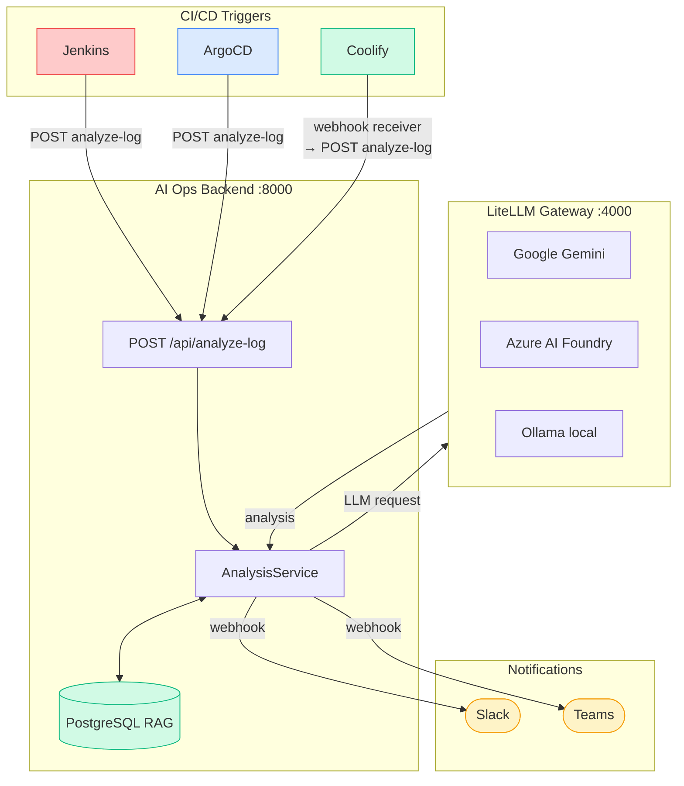
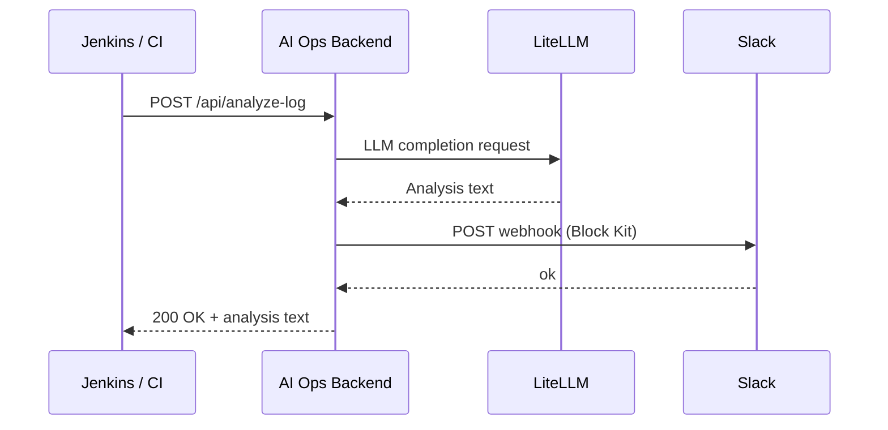
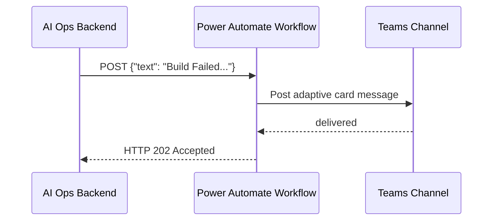
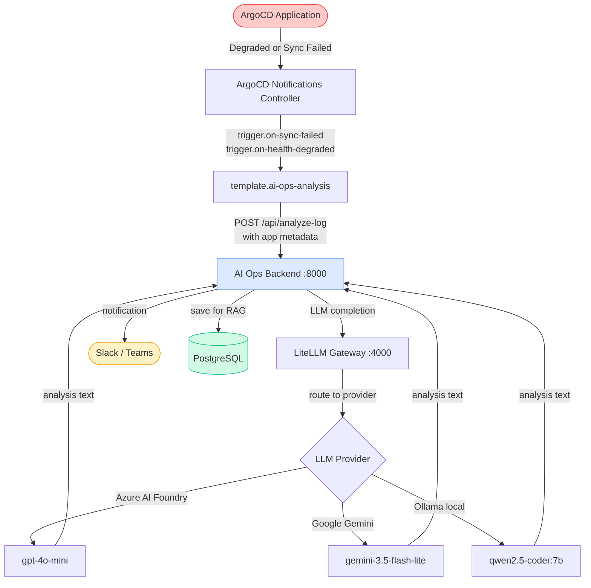
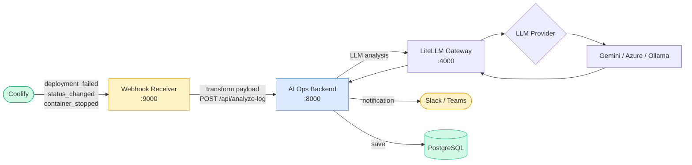

# Setup Guides — AI Ops Log Analyzer

Step-by-step guides for configuring integrations. Each section is independent.

---

## Table of Contents

1. [Slack Incoming Webhook](#1-slack-incoming-webhook)
2. [Microsoft Teams Webhook (Power Automate)](#2-microsoft-teams-webhook-power-automate)
3. [ArgoCD Integration](#3-argocd-integration)
4. [Coolify Integration](#4-coolify-integration)

---

## Overview — Notification flow



---

### What this does

The AI Ops backend sends a structured Block Kit message to a Slack channel
after every build failure analysis. The message includes the problem summary,
root cause, fix steps, and a direct link to the build log.



### Prerequisites

- A Slack workspace where you have permission to install apps
- Access to [api.slack.com](https://api.slack.com)

### Step 1 — Create a Slack App

1. Go to [api.slack.com/apps](https://api.slack.com/apps)
2. Click **Create New App**
3. Choose **From scratch**
4. Enter an app name — for example: `AI Ops`
5. Select the **workspace** where you want to receive notifications
6. Click **Create App**

### Step 2 — Enable Incoming Webhooks

1. In the left sidebar of your app page, click **Incoming Webhooks**
2. Toggle **Activate Incoming Webhooks** to **On**
3. Click **Add New Webhook to Workspace** (appears after enabling)
4. Select the **channel** where AI Ops should post notifications
   - Public channel: `#builds`, `#ci-alerts`, etc.
   - Private channel: the app must be invited to the channel first
5. Click **Allow**

### Step 3 — Copy the webhook URL

After authorizing, Slack shows the webhook URL in this format:

```
https://hooks.slack.com/services/{workspace-id}/{channel-id}/{token}
```

Example: `https://hooks.slack.com/services/TXXXXX/BXXXXX/xxxxxxxxxx`

Copy the full URL — this is your `SLACK_WEBHOOK_URL`.

> The URL is tied to the specific channel you selected. If you want to post to
> multiple channels, create one webhook per channel (repeat Step 2).

### Step 4 — Add to .env

```env
SLACK_NOTIFY_ENABLE=true
SLACK_WEBHOOK_URL=https://hooks.slack.com/services/{your-webhook-url}
```

Then restart the backend:

```bash
docker compose restart backend
```

### Step 5 — Test the webhook

Send a test message directly to verify the URL works:

```bash
curl -X POST "${SLACK_WEBHOOK_URL}" \
  -H "Content-Type: application/json" \
  -d '{
    "text": "Test from AI Ops. If you see this, the webhook is working."
  }'
```

Expected response: `ok`

A message should appear in the selected channel within a few seconds.

### Step 6 — Customize the app appearance (optional)

To make the notification look professional in Slack:

1. In the app settings page, go to **Basic Information**
2. Scroll to **Display Information**
3. Set **App Name**: `AI Ops`
4. Upload an **App Icon** (any square image, min 512×512px)
5. Set **Background Color**: `#0f172a` (dark navy, matches the project theme)
6. Click **Save Changes**

The app name and icon appear next to every notification in Slack.

### Notification format

When a build fails, Slack receives a Block Kit message with this structure:

**🔴 Build Failed: order-service #26**  
Provider: gemini | Model: gemini-3.5-flash-lite

**🚨 Problem**  
The Maven build failed with 3 test failures in `OrderServiceTest`.

**🔍 Root Cause**
1. `calculateDiscount` threw `NullPointerException` — no null check
2. Boundary condition uses `>` instead of `>=` at $1000 threshold
3. Confirming a CANCELLED order incorrectly allowed

**🛠️ Fix Steps**
1. Add null check at top of `calculateDiscount`
2. Change `>` to `>=` in `OrderService.java` line 97
3. Remove CANCELLED from `confirmOrder` guard

**🔗 View Build Log** → [Jenkins Console](https://jenkins.example.com/job/order-service/26)

Technical terms wrapped in backticks render as `monospace` in Slack.

### Managing the app

| Task | Where |
|---|---|
| View all webhooks | api.slack.com/apps → your app → Incoming Webhooks |
| Rotate a webhook URL | Incoming Webhooks → click the webhook → Regenerate |
| Delete a webhook | Incoming Webhooks → click the webhook → Revoke |
| Change the channel | Revoke old webhook, create new webhook for new channel |
| View delivery logs | api.slack.com/apps → your app → Event Subscriptions |

### Troubleshooting

| Problem | Likely cause | Fix |
|---|---|---|
| `invalid_token` from Slack API | Wrong or expired webhook URL | Regenerate the webhook URL in app settings |
| `channel_not_found` | App not in the channel | Invite the app: `/invite @AI Ops` in the channel |
| No message in Slack | Backend notifications disabled | Check `SLACK_NOTIFY_ENABLE=true` in `.env` |
| `no_service` error | Webhook URL deleted or revoked | Create a new webhook URL |
| Message arrives but no formatting | Old Slack client | Slack Block Kit requires Slack app version 4.x+ |
| Rate limit (HTTP 429) | Too many notifications per minute | Slack allows 1 message/second; reduce build frequency |

---

## 2. Microsoft Teams Webhook (Power Automate)

Office 365 Connectors were deprecated in August 2024. The current method is
a **Power Automate workflow**.



### Prerequisites

- Microsoft 365 account with access to the target Teams channel
- Power Automate access (available to all Microsoft 365 users at flow.microsoft.com)

### Steps

**Step 1 — Open the target Teams channel**

In Microsoft Teams, navigate to the channel where you want to receive
notifications. Click **...** (More options) next to the channel name.

**Step 2 — Open Workflows**

Select **Workflows** from the context menu. If you do not see it, use the
search bar inside the ... menu.

**Step 3 — Find the webhook template**

In the Workflows panel, search for:
```
Post to a channel when a webhook request is received
```
Select that template from the results.

**Step 4 — Configure and save the workflow**

1. Give the workflow a name, for example: `AI Ops Notifications`
2. Verify the channel shown is correct
3. Click **Next** then **Add workflow**
4. Power Automate creates the workflow and shows you the webhook URL

**Step 5 — Copy the webhook URL**

The URL looks like:
```
https://prod-XX.westus.logic.azure.com:443/workflows/XXXX/triggers/manual/paths/invoke?...
```
Copy it — this is your `TEAMS_WEBHOOK_URL`.

**Step 6 — Add to .env**

```env
TEAMS_NOTIFY_ENABLE=true
TEAMS_WEBHOOK_URL=https://prod-XX.westus.logic.azure.com:443/workflows/...
```

**Step 7 — Restart backend**

```bash
docker compose restart backend
```

### Prevent webhook expiry

Power Automate workflows expire after **90 days of inactivity** by default.

To disable expiry:
1. Go to [flow.microsoft.com](https://flow.microsoft.com)
2. Open **My flows** → find your workflow → click **Edit**
3. Click **Settings** (gear icon on the trigger step)
4. Set **Trigger conditions** expiry to **Never**
5. Save

### Test the webhook

```bash
curl -X POST "${TEAMS_WEBHOOK_URL}" \
  -H "Content-Type: application/json" \
  -d '{"text": "Test from AI Ops. If you see this, the webhook is working."}'
```

A message should appear in the Teams channel within a few seconds.

### Troubleshooting

| Problem | Likely cause | Fix |
|---|---|---|
| No message in Teams | Wrong channel or workflow paused | Check flow.microsoft.com → My flows |
| HTTP 400 from webhook | Payload format wrong | Teams expects `{"text": "..."}` plain JSON |
| HTTP 410 Gone | Webhook expired | Create a new workflow, update TEAMS_WEBHOOK_URL |
| Workflow not found in Teams | Microsoft 365 policy restriction | Ask your IT admin to enable Power Automate in Teams |

---

## 3. ArgoCD Integration

### What this does

When an ArgoCD Application becomes **Degraded** or **Sync Failed**, ArgoCD
Notifications calls the AI Ops backend with the failure metadata. The backend
runs LLM analysis and sends Slack/Teams notifications.



### Prerequisites

- A running Kubernetes cluster (local: minikube or kind; managed: EKS, GKE, AKS)
- `kubectl` configured to talk to the cluster
- AI Ops backend reachable from inside the cluster

### Step 1 — Install ArgoCD

```bash
kubectl create namespace argocd

kubectl apply -n argocd \
  -f https://raw.githubusercontent.com/argoproj/argo-cd/stable/manifests/install.yaml
```

Wait until all pods are Running:

```bash
kubectl get pods -n argocd --watch
# Wait for all pods to show Running/Completed status, then Ctrl+C
```

Get the initial admin password:

```bash
kubectl get secret argocd-initial-admin-secret \
  -n argocd \
  -o jsonpath="{.data.password}" | base64 -d
echo  # print newline
```

Access the UI by forwarding port 8080:

```bash
kubectl port-forward svc/argocd-server -n argocd 8080:443
# Open https://localhost:8080 in your browser
# Username: admin  Password: (from above)
```

### Step 2 — Install ArgoCD Notifications

```bash
kubectl apply -n argocd \
  -f https://raw.githubusercontent.com/argoproj-labs/argocd-notifications/stable/manifests/install.yaml
```

Verify it is running:

```bash
kubectl get pods -n argocd -l app.kubernetes.io/name=argocd-notifications-controller
# Should show 1/1 Running
```

### Step 3 — Configure the backend URL secret

Edit `argocd/argocd-notifications-secret.yaml` and set the backend URL.

If the AI Ops backend runs **inside the same cluster** (recommended):
```yaml
stringData:
  ai-ops-backend-url: http://ai-ops-backend.ai-ops.svc.cluster.local:8000
```

If the AI Ops backend runs **outside the cluster** (e.g. Docker Compose on host):
```yaml
stringData:
  ai-ops-backend-url: http://192.168.1.100:8000  # use your machine's LAN IP
```

> Do not use `localhost` or `127.0.0.1` — from inside the cluster those point
> to the cluster node, not your host machine.

Apply the secret:

```bash
kubectl apply -f argocd/argocd-notifications-secret.yaml
```

### Step 4 — Apply the Notifications ConfigMap

```bash
kubectl apply -f argocd/argocd-notifications-cm.yaml
```

Verify it was applied:

```bash
kubectl get configmap argocd-notifications-cm -n argocd -o yaml
```

### Step 5 — Subscribe an Application to the triggers

Add annotations to the Application you want to monitor.

**Option A — kubectl:**

```bash
kubectl annotate application <your-app-name> -n argocd \
  notifications.argoproj.io/subscribe.on-sync-failed.ai-ops-backend="" \
  notifications.argoproj.io/subscribe.on-health-degraded.ai-ops-backend=""
```

**Option B — Add to the Application manifest:**

```yaml
apiVersion: argoproj.io/v1alpha1
kind: Application
metadata:
  name: my-service
  namespace: argocd
  annotations:
    notifications.argoproj.io/subscribe.on-sync-failed.ai-ops-backend: ""
    notifications.argoproj.io/subscribe.on-health-degraded.ai-ops-backend: ""
spec:
  project: default
  source:
    repoURL: https://github.com/your-org/your-repo
    targetRevision: HEAD
    path: k8s
  destination:
    server: https://kubernetes.default.svc
    namespace: default
```

### Step 6 — Test the integration

Trigger a sync failure to test end-to-end:

```bash
# Point an app at a non-existent image tag to cause a health failure
kubectl patch application my-service -n argocd \
  --type merge \
  -p '{"spec":{"source":{"helm":{"parameters":[{"name":"image.tag","value":"does-not-exist-999"}]}}}}'
```

Watch the Notifications controller logs:

```bash
kubectl logs -n argocd \
  deployment/argocd-notifications-controller \
  -f --tail=50
```

You should see a line like:
```
Sending notification ... to destination ai-ops-backend
```

And then within a few seconds:
```
Notification ... sent
```

Check that analysis appears in Slack/Teams.

### Verify the notification was sent

```bash
# List all notification-related events
kubectl get events -n argocd --field-selector reason=NotificationDelivered
```

### Troubleshooting

| Problem | Likely cause | Fix |
|---|---|---|
| No notification sent | Trigger not subscribed | Check annotations on the Application |
| `connection refused` in controller log | Backend URL wrong or unreachable | Verify `ai-ops-backend-url` in the secret |
| `404 Not Found` | Backend healthy but wrong path | Confirm backend is running: `curl http://<url>/health` |
| No events at all | Notifications controller not installed | Re-run Step 2 |
| Trigger fires but analysis empty | `cleaned_log` too short | ArgoCD metadata fields may be empty for this failure type |

---

## 4. Coolify Integration

### What this does

Coolify sends a webhook to a lightweight Python receiver (`webhook_receiver.py`)
that runs alongside your stack. The receiver transforms Coolify's fixed payload
format into `POST /api/analyze-log` and the backend handles LLM analysis and
notifications.



### Prerequisites

- Coolify running on a server (see install below if you do not have it yet)
- AI Ops stack running and reachable from the Coolify server

### Step 1 — Install Coolify (if not already installed)

Run this on a Linux server (Ubuntu 22.04+ recommended, minimum 2 vCPU / 4 GB RAM):

```bash
curl -fsSL https://cdn.coollabs.io/coolify/install.sh | bash
```

After installation, open `http://<server-ip>:8000` in your browser and complete
the setup wizard. The default credentials are shown on first login.

### Step 2 — Start the webhook receiver

**Option A — alongside the AI Ops Docker Compose stack:**

```bash
# From the repository root
docker compose \
  -f docker-compose.yml \
  -f coolify/docker-compose.coolify-receiver.yml \
  up -d --build
```

The receiver listens on port **9000**.

**Option B — standalone Python (for quick testing):**

```bash
cd coolify
pip install -r ../backend/requirements.txt  # only needs stdlib, so pip is optional
export AI_OPS_BACKEND_URL=http://localhost:8000
export RECEIVER_PORT=9000
python3 webhook_receiver.py
```

Verify the receiver is running:

```bash
curl -s http://localhost:9000
# Expected: some response (even a 404 is fine — it means the server is up)
```

### Step 3 — Configure the webhook in Coolify

1. Log in to your Coolify dashboard
2. Click your **user icon** (top right) → **Settings**
3. In the left sidebar click **Notifications**
4. Scroll to the **Webhook** section and click **Enable**
5. Enter the receiver URL:
   ```
   http://<your-server-ip>:9000
   ```
   > If the receiver and Coolify run on the **same server**, you can use:
   > ```
   > http://172.17.0.1:9000
   ```
   > (the Docker bridge gateway — avoids `localhost` issues inside containers)
6. Optionally set a **Secret** — copy the same value into:
   ```env
   # In coolify/docker-compose.coolify-receiver.yml or as an env var
   RECEIVER_SECRET=your-secret-here
   ```
7. Click **Save**

### Step 4 — Send a test notification

In Coolify Settings → Notifications → Webhook, click **Send Test Notification**.

Check the receiver logs:

```bash
docker compose logs coolify-receiver -f
# Expected output:
# INFO - Received failure event: test
# INFO - Skipping non-failure event: test (success=True)
```

The test event has `"success": true` so the receiver correctly skips it.
To trigger a real analysis, deploy an app with an intentionally broken config.

### Step 5 — Trigger a real failure (optional)

Create a simple application in Coolify pointing to a private image or invalid
config. When the deployment fails, Coolify sends a `deployment_failed` event.

Watch the receiver handle it:

```bash
docker compose logs coolify-receiver -f
# Expected:
# INFO - Received failure event: deployment_failed
# INFO - Analysis complete for deployment_failed on my-app — provider: gemini
```

And check Slack/Teams for the notification.

### Step 6 — Configure notifications in .env

The notifications are sent by the AI Ops backend, not the receiver. Make sure
the backend has the correct flags set:

```env
# In .env
SLACK_NOTIFY_ENABLE=true
SLACK_WEBHOOK_URL=https://hooks.slack.com/services/{your-webhook-url}

TEAMS_NOTIFY_ENABLE=true
TEAMS_WEBHOOK_URL=https://prod-XX.westus.logic.azure.com:443/workflows/...
```

Then restart the backend:

```bash
docker compose restart backend
```

### Environment variables for the receiver

| Variable | Default | Description |
|---|---|---|
| `AI_OPS_BACKEND_URL` | `http://localhost:8000` | AI Ops backend URL |
| `RECEIVER_PORT` | `9000` | Port the receiver listens on |
| `RECEIVER_SECRET` | _(empty)_ | Shared secret for HMAC-SHA256 signature verification |

### Troubleshooting

| Problem | Likely cause | Fix |
|---|---|---|
| No request reaching the receiver | Coolify cannot reach port 9000 | Check firewall; try `curl http://<receiver-ip>:9000` from Coolify server |
| `{"status":"skipped"}` in response | Event is a success event | Correct — receiver only forwards failure events |
| `{"status":"backend_error"}` | Receiver reached backend but got non-200 | Check backend logs: `docker compose logs backend` |
| HMAC signature mismatch | Secret mismatch | Set the same value in Coolify settings and `RECEIVER_SECRET` env var |
| Receiver not starting | Port 9000 already in use | Change `RECEIVER_PORT` to a free port (e.g. 9001) |

---

## Quick reference — all webhook URLs

| Integration | Where to create | URL format |
|---|---|---|
| Slack | api.slack.com/apps → Incoming Webhooks | `https://hooks.slack.com/services/{workspace}/{channel}/{token}` |
| Teams | Teams channel → Workflows → "Post to channel when webhook received" | `https://prod-XX.westus.logic.azure.com:443/workflows/...` |
| Coolify receiver | Run `webhook_receiver.py` then configure in Coolify Settings | `http://<your-server>:9000` |
| ArgoCD | Applied via `argocd-notifications-secret.yaml` | `http://<backend-host>:8000` |
