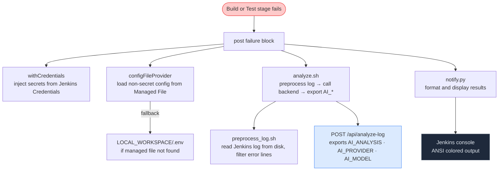
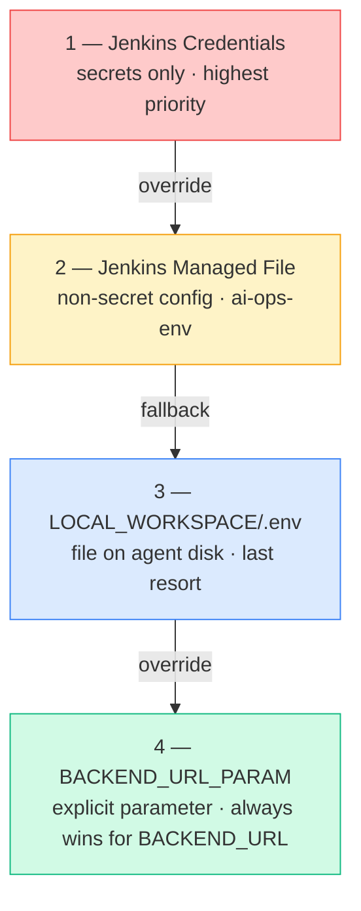
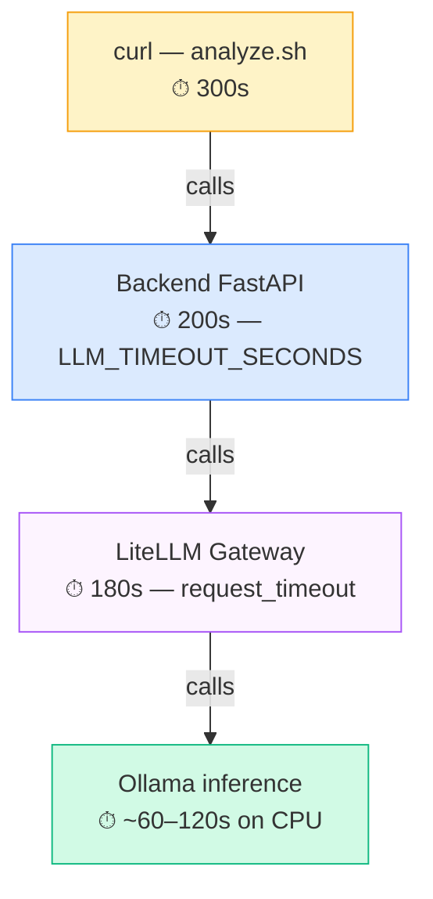

# Jenkins Pipeline — AI Ops Log Analyzer

Declarative Jenkins pipeline that automatically analyzes failed build logs using AI and sends structured notifications to Teams and/or Slack.

## How it works



Any failure in the analysis or notification steps is caught — it never affects the pipeline result.

---

## Required Jenkins plugins

Install all plugins from **Manage Jenkins → Plugins → Available plugins**.

| Plugin | Purpose | Required |
|---|---|---|
| **Pipeline** | Declarative pipeline syntax | Yes |
| **Config File Provider** | Jenkins Managed Files for `.env` content | Yes (for managed file feature) |
| **Credentials Binding** | `withCredentials` for injecting secrets | Yes (for credentials feature) |
| **AnsiColor** | Colored ANSI output in Jenkins console | Recommended |
| **Blue Ocean** | Modern pipeline UI with stage visualization | Recommended |
| **Pipeline Stage View** | Stage progress view on classic UI | Recommended |
| **Docker Pipeline** | `docker build` inside pipeline steps | Required for `java-order-service` demo |
| **Git** | SCM checkout from Git repositories | Yes (if using SCM pipeline definition) |

---

## Environment configuration

The pipeline resolves configuration from three sources in this priority order:



### Managed File setup (non-secret config)

Stores non-secret `.env` variables centrally on Jenkins — no need to maintain a file on the agent disk.

1. **Manage Jenkins → Managed files → Add a new Config → Custom file**
2. Set **ID** to `ai-ops-env` (must match `MANAGED_ENV_FILE_ID` in `Jenkinsfile`)
3. Set **Name** to something descriptive, e.g. `AI Ops Environment`
4. Paste the contents of `.env` **without secrets** (leave secret values blank — credentials override them):

```env
LITELLM_BASE_URL=http://litellm:4000
OLLAMA_PROVIDER_ENABLE=false
GOOGLE_GEMINI_PROVIDER_ENABLE=true
GOOGLE_GEMINI_MODEL=gemini-3.5-flash-lite
BACKEND_URL=http://localhost:8000
SLACK_NOTIFY_ENABLE=true
TEAMS_NOTIFY_ENABLE=false
ANSI_CONSOLE=true
RAG_TOP_N=3
LLM_TIMEOUT_SECONDS=200
```

5. Click **Submit**

### Credentials setup (secrets)

Stores sensitive values in the Jenkins Credentials store — never in files or pipeline code.

**Manage Jenkins → Credentials → (global) → Add Credentials**

For each entry, choose **Kind: Secret text**, then fill in:

| Credential ID | Env var injected | When required |
|---|---|---|
| `ai-ops-db-password` | `DB_PASSWORD` | Always |
| `ai-ops-litellm-api-key` | `LITELLM_API_KEY` | Always |
| `ai-ops-gemini-api-key` | `GOOGLE_GEMINI_API_KEY` | When `GOOGLE_GEMINI_PROVIDER_ENABLE=true` |
| `ai-ops-azure-client-secret` | `AZURE_CLIENT_SECRET` | When `AZURE_FOUNDRY_PROVIDER_ENABLE=true` |
| `ai-ops-slack-webhook-url` | `SLACK_WEBHOOK_URL` | When `SLACK_NOTIFY_ENABLE=true` |
| `ai-ops-teams-webhook-url` | `TEAMS_WEBHOOK_URL` | When `TEAMS_NOTIFY_ENABLE=true` |

Only configure the credentials that apply to your setup. Missing credentials are probed and skipped gracefully — the value falls back to whatever is in the env file.

---

## Pipeline parameters

| Parameter | Default | Description |
|---|---|---|
| `LOCAL_WORKSPACE` | `/mnt/c/works/local/ai-ops` | Absolute path to the project on the Jenkins agent. Scripts and `.env` fallback are read from here. |
| `BACKEND_URL_PARAM` | _(empty)_ | Explicit `BACKEND_URL` override. Takes priority over all env sources. |
| `DEMO_PROJECT` | `none` | `java-order-service` — runs a Spring Boot demo with intentional bugs via Docker. Produces a real Maven test failure for AI analysis. |
| `DEMO_FAIL_BUILD` | `false` | Fail the build with a synthetic Python error for a quick AI analysis demo. Ignored when `DEMO_PROJECT` is set. |

---

## Scripts

All business logic lives in `jenkins/scripts/` — the Jenkinsfile only orchestrates.

### `analyze.sh`

Sources into the pipeline shell to request AI analysis and export results.

**Exports:**
- `AI_ANALYSIS` — full plain-text analysis from the backend
- `AI_PROVIDER` — LLM provider that served the request
- `AI_MODEL` — concrete model used
- `AI_STATUS` — `ok` on HTTP 200, `failed` otherwise

**Log source resolution:**
1. `JENKINS_LOG_FILE` env var — path to Jenkins build log on disk (set automatically)
2. `LOCAL_WORKSPACE/.env` fallback for the real build case
3. Synthetic error text when `DEMO_FAIL_BUILD=true` and no demo project selected

### `preprocess_log.sh`

Reads the Jenkins build log and filters it down to error-relevant lines.

1. Reads `JENKINS_LOG_FILE` (Jenkins writes the raw log at `$JENKINS_HOME/jobs/$JOB_NAME/builds/$BUILD_NUMBER/log`)
2. Takes the last 100 lines
3. Keeps only lines matching `ERROR`, `FATAL`, `Exception`, `Failed` (case-insensitive)
4. Falls back to last 50 raw lines if nothing matches
5. Caps output at 8,000 characters

The result is the `cleaned_log` sent to the backend.

### `notify.py`

Reads `AI_*` env vars and sends notifications to configured channels.

- **Jenkins console** — ANSI colored output with section headings (requires AnsiColor plugin). Set `ANSI_CONSOLE=false` to disable colors.
- **Slack** — Block Kit message with `*bold*` section headings and `` `monospace` `` for technical terms
- **Teams** — Power Automate webhook with plain text body

---

## Notifications

### Slack setup

1. Go to [api.slack.com/apps](https://api.slack.com/apps) → **Create New App → From scratch**
2. Choose a name and workspace → **Create App**
3. **Incoming Webhooks** → toggle on → **Add New Webhook to Workspace**
4. Select a channel → **Allow** → copy the URL
5. Add as Jenkins credential with ID `ai-ops-slack-webhook-url`

Enable in managed file or local `.env`:
```env
SLACK_NOTIFY_ENABLE=true
```

### Teams setup

Office 365 Connectors were deprecated in August 2024. Use Power Automate instead:

1. Open the target Teams channel → **...** → **Workflows**
2. Search: **"Post to a channel when a webhook request is received"**
3. Name the workflow → **Next** → **Add workflow** → copy the URL
4. Add as Jenkins credential with ID `ai-ops-teams-webhook-url`

Enable in managed file or local `.env`:
```env
TEAMS_NOTIFY_ENABLE=true
```

> Power Automate webhooks expire after 90 days of inactivity by default. Open the workflow in Power Automate and disable expiration.

### Notification content

Both channels receive:
- Build name and number
- AI provider and model
- Structured analysis (Problem / Root Cause / Fix Steps) with technical terms highlighted
- Direct link to Jenkins build console log

---

## Installing Jenkins

### Option A — Docker (recommended for local development)

```bash
docker volume create jenkins_home

docker run -d \
  --name jenkins \
  --restart unless-stopped \
  -p 8080:8080 \
  -p 50000:50000 \
  -v jenkins_home:/var/jenkins_home \
  -v /var/run/docker.sock:/var/run/docker.sock \
  jenkins/jenkins:lts-jdk21

# Get the initial admin password
docker exec jenkins cat /var/jenkins_home/secrets/initialAdminPassword
```

Open `http://localhost:8080` and complete the setup wizard.

The `-v /var/run/docker.sock` mount gives Jenkins access to the host Docker daemon — required for the `java-order-service` demo.

> If Jenkins runs in Docker and the backend runs in Docker Compose on the same host, use `http://host.docker.internal:8000` (Docker Desktop) or `http://172.17.0.1:8000` (Linux) as `BACKEND_URL`.

### Option B — Direct install on Ubuntu/Debian

```bash
sudo apt update && sudo apt install -y fontconfig openjdk-21-jre

sudo wget -O /etc/apt/keyrings/jenkins-keyring.asc \
  https://pkg.jenkins.io/debian-stable/jenkins.io-2026.key

echo "deb [signed-by=/etc/apt/keyrings/jenkins-keyring.asc] \
  https://pkg.jenkins.io/debian-stable binary/" | \
  sudo tee /etc/apt/sources.list.d/jenkins.list > /dev/null

sudo apt update && sudo apt install -y jenkins
sudo systemctl enable --now jenkins

# Get the initial admin password
sudo cat /var/lib/jenkins/secrets/initialAdminPassword
```

Open `http://<host>:8080` and complete setup.

**Allow Jenkins to use Docker (required for demo project):**
```bash
sudo usermod -aG docker jenkins
sudo systemctl restart jenkins
```

---

## Creating the pipeline job

1. **New Item** → enter a name → **Pipeline** → **OK**
2. Under **Pipeline**, set **Definition** to `Pipeline script from SCM`
3. Set **SCM** to Git, point to this repository
4. Set **Script Path** to `jenkins/Jenkinsfile`
5. **Save** → **Build with Parameters** to run

If not using SCM, paste `Jenkinsfile` content directly into the **Pipeline script** field.

---

## Demo scenarios

### Scenario 1 — Java Spring Boot test failures (real Maven output)

Produces a real Docker build failure with 3 intentional unit test failures in `OrderService`.

```
DEMO_PROJECT    = java-order-service
DEMO_FAIL_BUILD = false
```

The AI will analyze actual Maven Surefire output including `NullPointerException`, off-by-one discount logic, and invalid state transition bugs.

### Scenario 2 — Synthetic Python error (quick demo, no Docker needed)

```
DEMO_PROJECT    = none
DEMO_FAIL_BUILD = true
```

Fails immediately with a fake `ModuleNotFoundError` — useful for testing the notification pipeline quickly.

---

## Console output with AnsiColor

When the AnsiColor plugin is installed and `ANSI_CONSOLE=true`:

```
════════════════════════════════════════════════════════
AI OPS LOG ANALYSIS
Provider: gemini | Model: gemini-3.5-flash-lite
════════════════════════════════════════════════════════

🚨 Problem        ← red
  The Maven build failed...

🔍 Root Cause     ← yellow
  1. `calculateDiscount` threw `NullPointerException`...

🛠️ Fix Steps      ← green
  1. Add null check in `calculateDiscount`...

════════════════════════════════════════════════════════
```

Set `ANSI_CONSOLE=false` in `.env` or managed file to disable colors.

---

## Timeout chain



A curl timeout is non-fatal — `AI_STATUS` is set to `failed`, the notification includes "AI analysis unavailable", and the pipeline continues.
