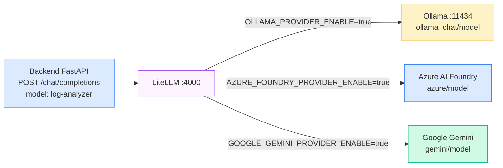
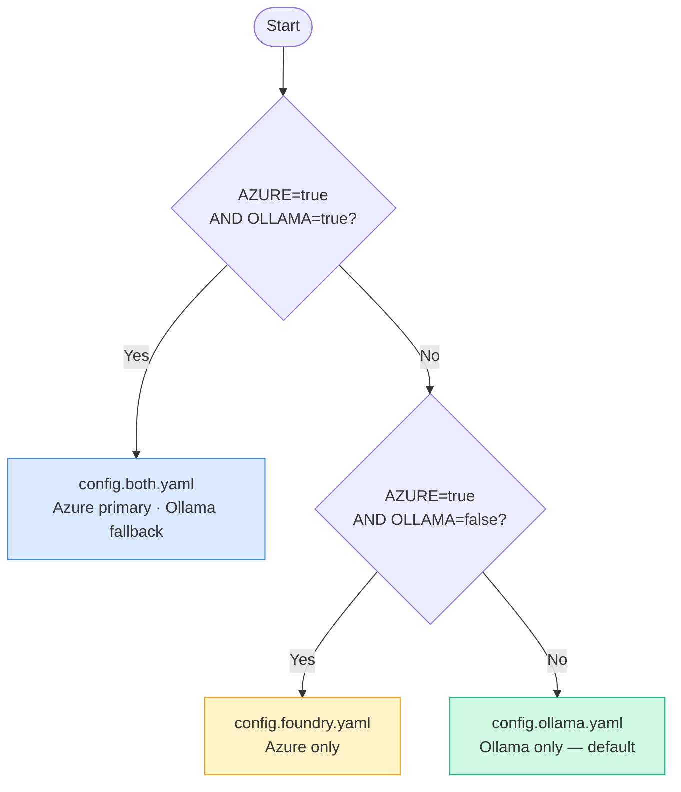

# LiteLLM Gateway — AI Ops Log Analyzer

LiteLLM acts as a unified OpenAI-compatible proxy between the backend and the actual LLM providers (Ollama and/or Azure AI Foundry). The backend always calls one endpoint (`/chat/completions`) using the `log-analyzer` model group, and LiteLLM handles routing, authentication, retries, and fallback transparently.

## Role in the stack



The backend is unaware of which provider handles a request. LiteLLM resolves the `log-analyzer` model group to the correct upstream and returns a standard OpenAI response.

## Config files

Three config files cover all provider combinations. The correct one is selected automatically at container startup based on environment flags:

| File | When used | Providers |
|---|---|---|
| `config.ollama.yaml` | `OLLAMA_PROVIDER_ENABLE=true`, `AZURE_FOUNDRY_PROVIDER_ENABLE=false` | Ollama only |
| `config.foundry.yaml` | `OLLAMA_PROVIDER_ENABLE=false`, `AZURE_FOUNDRY_PROVIDER_ENABLE=true` | Azure AI Foundry only |
| `config.both.yaml` | Both `=true` | Azure AI Foundry primary, Ollama fallback |

Selection logic in `docker-compose.yml`:



Before starting, the selected file is processed with `sed` to replace `__OLLAMA_MODEL__` and `__AZURE_MODEL__` placeholders with the actual values from environment variables, then written to `/tmp/litellm-config.yaml`.

## Timeout settings

All three configs have matching timeout values:

```yaml
litellm_params:
  timeout: 180          # per-provider call timeout (seconds)
  stream_timeout: 180   # streaming response timeout (Ollama only)

litellm_settings:
  request_timeout: 180  # global gateway timeout (seconds)
```

These are set to 180 seconds to accommodate Ollama's CPU inference time (~60-120s for `qwen2.5-coder:7b`). The backend's `LLM_TIMEOUT_SECONDS=200` is set higher to give LiteLLM room to complete before the backend client cancels.

> **Important:** After changing any config file, restart the LiteLLM container for the changes to take effect:
> ```bash
> docker compose restart litellm
> ```

## Azure AI Foundry authentication

LiteLLM uses a Microsoft Entra Service Principal (client credentials flow) — no `AZURE_API_KEY` is needed. Token refresh is handled automatically by LiteLLM with `enable_azure_ad_token_refresh: true`.

Required environment variables when using Foundry:

| Variable | Description |
|---|---|
| `AZURE_CLIENT_ID` | Service principal application (client) ID |
| `AZURE_CLIENT_SECRET` | Service principal secret |
| `AZURE_TENANT_ID` | Entra tenant ID |
| `AZURE_API_BASE` | Azure OpenAI endpoint, e.g. `https://<resource>.openai.azure.com` |
| `AZURE_API_VERSION` | API version, e.g. `2024-10-21` |
| `AZURE_MODEL` | Deployment name, e.g. `gpt-4o-mini` |
| `AZURE_SCOPE` | Token scope, default `https://cognitiveservices.azure.com/.default` |

## Fallback behavior (`config.both.yaml`)

When both providers are enabled, LiteLLM uses the `fallbacks` setting:

```yaml
litellm_settings:
  fallbacks: [{"log-analyzer": ["log-analyzer"]}]
```

If the primary provider (Azure AI Foundry) fails or times out, LiteLLM automatically retries with the fallback (Ollama). The backend receives a normal response and logs which provider ultimately served the request via the `X-AI-Provider` response header.

## Changing the Ollama model

Set `OLLAMA_MODEL` in `.env`:

```env
OLLAMA_MODEL=qwen2.5-coder:3b   # faster, less accurate
OLLAMA_MODEL=qwen2.5-coder:7b   # default, slower on CPU
```

The `ollama-model` service pulls the configured model automatically on first start. After changing the model, recreate the stack so the pull runs again:

```bash
docker compose down
docker compose up -d --build
```

> **Performance note:** Smaller models are significantly faster on CPU. `qwen2.5-coder:1.5b` or `qwen2.5-coder:3b` will reduce inference time from 60-120s to 10-30s with a modest reduction in analysis quality.

## Checking LiteLLM health

```bash
# Liveness check
curl http://localhost:4000/health/liveliness

# View loaded config (inspect what was actually applied)
docker compose exec litellm cat /tmp/litellm-config.yaml

# View LiteLLM logs
docker compose logs -f litellm
```
